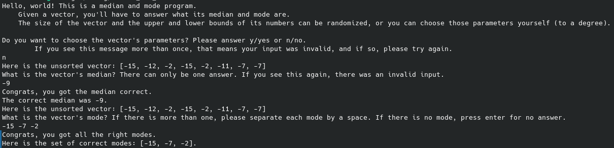
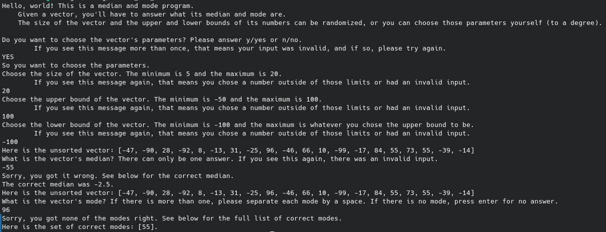

# Project description

This is a median and mode project where a vector with a random length (from a minimum of 5 to a maximum of 20) with randomized numbers (with a predeteremined upper and lower 
bound) will be spit out and the user has to correctly answer what the vector's median and mode are. 

The numbers inside the vector will always be random, but the user will be prompted to choose between randomizing the vector length and the upper + lower bound of the numbers (given it's within the predetermined min and max), or choosing those parameters themselves.

The vector that is spit out is unsorted, so correctly answering the median and mode can be non-trivial, especially on vectors with lengths above 15.

This project has unit testing.

# How to run it

Clone the repo and make sure you have Rust installed in your VSCODE. Go to the proper directory and type in 'cargo run' and you'll see it on your terminal.
If you use a different I.D.E., provided it can run Rust, then the process is likely similar.

# Program in action

This first example is a fully random vector.

The second example is the user choosing the parameters of the vector.

# Problems

None so far. To see the problems that were fixed, please look at the commit history and the previous READMEs that listed the various problems.

# Future fixes/planned changes

None so far. After all the previous changes and problems fixed, I am now pretty happy with the state of the program.

# Genesis of the project

I got the idea to make this from the Rust book as one of the three suggested exercises: https://doc.rust-lang.org/stable/book/ch08-03-hash-maps.html#summary. It is an expanded modification of it where I added the ability for the user to create their own vector.

# Notes on overview.txt and vector creation flowchart.png included in the project

If you can, please ignore them because they're poorly drawn or for my own benefit. I included them for 
a) posterity for my sake so I can look back at the project and quickly see the planning/overall structure if I forget, and 
b) also so any curious strangers can see a visual representation of the flow of the program.
